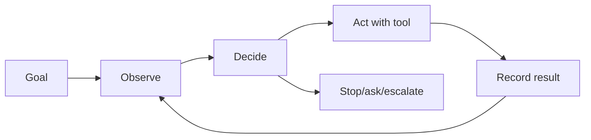

# Agent loop design

**Domain:** AI Engineering
**Group:** Agentic workflows
**Example environment:** node

## Summary

An agent loop repeatedly observes state, decides next action, calls tools, records results, and stops when the goal is complete or blocked. The hard parts are stopping criteria, state, permissions, retries, and recovery.

## Why it matters

Use this group to design loops that plan, act, observe, persist state, ask for human review, and recover from partial progress.

## Architecture sketch



## Related concepts

- System Design: Async workflow design
- Backend: Circuit breaker + bulkhead patterns

## JavaScript example

```js
const runAgentStep = async (state, tools) => {
  if (state.done) return state;
  const action = state.nextAction;
  const observation = await tools[action.name](action.args);
  return { ...state, observations: [...state.observations, observation] };
};
```

## Explain it clearly

A solid explanation should define the mechanism, name the failure mode it prevents or creates, and describe the trade-off you would make in a real JavaScript/Node.js application.
