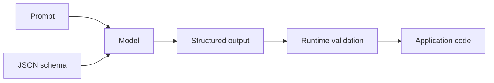

# JSON schema constrained output

**Domain:** AI Engineering
**Group:** Structured outputs and tool use
**Example environment:** node

## Summary

Schema-constrained output makes model responses machine-checkable by defining required fields, types, enums, arrays, and nesting. It reduces parser fragility, but downstream code must still validate and handle refusals or partial failures.

## Why it matters

Use this group to make model interactions machine-checkable with schemas, tool contracts, validation, dispatch, and permission boundaries.

## Architecture sketch



## Related concepts

- Backend: API contract testing
- System Design: Client-edge-service boundaries

## JavaScript example

```js
const schema = {
  type: 'object',
  required: ['answer', 'confidence'],
  properties: {
    answer: { type: 'string' },
    confidence: { type: 'number', minimum: 0, maximum: 1 }
  }
};

console.log(schema);
```

## Explain it clearly

A solid explanation should define the mechanism, name the failure mode it prevents or creates, and describe the trade-off you would make in a real JavaScript/Node.js application.
