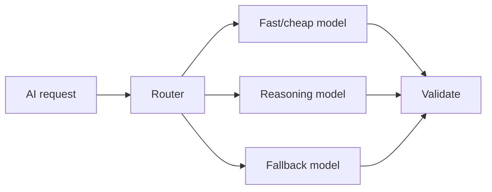

# Model routing and fallback

**Domain:** AI Engineering
**Group:** Model operations, cost, and rollout
**Role tags:** sr, ai
**Example environment:** node

## Summary

Model routing sends requests to different models based on task complexity, latency target, cost budget, context size, availability, safety policy, or tenant tier. Fallback should preserve correctness boundaries, not just retry anywhere.

## Why it matters

Use this group to route models, control cost, cache safely, stream responses, and roll out AI features with measurable risk.

## Architecture sketch



## Related concepts

- System Design: Cost-aware architecture
- System Design: Degradation and fallback design

## JavaScript example

```js
const routeModel = ({ tokens, risk, needsReasoning }) => {
  if (risk === 'high' || needsReasoning) return 'reasoning-model';
  if (tokens < 1000) return 'fast-model';
  return 'long-context-model';
};

console.log(routeModel({ tokens: 800, risk: 'low', needsReasoning: false }));
```

## Explain it clearly

A solid explanation should define the mechanism, name the failure mode it prevents or creates, and describe the trade-off you would make in a real JavaScript/Node.js application.
