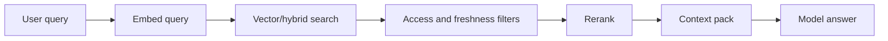

# RAG retrieval pipeline

**Domain:** AI Engineering
**Group:** Retrieval and knowledge grounding
**Role tags:** sr, ai
**Example environment:** node

## Summary

Retrieval-augmented generation pulls relevant source material into model context before generation. A production RAG pipeline includes indexing, filtering, retrieval, reranking, source packing, answer generation, and citation or grounding checks.

## Why it matters

Use this group to connect embeddings, chunking, metadata, retrieval, reranking, and source-of-truth rules into grounded answers.

## Architecture sketch



## Related concepts

- System Design: Read freshness routing
- Backend: Query planner and cost-based optimization

## JavaScript example

```js
const retrieve = async ({ query, search, rerank }) => {
  const candidates = await search(query);
  const ranked = await rerank(query, candidates);
  return ranked.slice(0, 5).map((doc) => doc.text).join('\n---\n');
};
```

## Explain it clearly

A solid explanation should define the mechanism, name the failure mode it prevents or creates, and describe the trade-off you would make in a real JavaScript/Node.js application.
