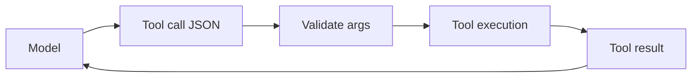

# Tool calling contracts

**Domain:** AI Engineering
**Group:** Structured outputs and tool use
**Role tags:** sr, ai
**Example environment:** node

## Summary

Tool calling contracts define the names, arguments, permissions, side effects, return values, and error semantics of tools the model may request. Strong contracts keep the model as a planner while application code remains the executor.

## Why it matters

Use this group to make model interactions machine-checkable with schemas, tool contracts, validation, dispatch, and permission boundaries.

## Architecture sketch



## Related concepts

- System Design: Secret and configuration boundaries
- Backend: API contract testing

## JavaScript example

```js
const tool = {
  name: 'lookup_order',
  sideEffect: 'read',
  inputSchema: { type: 'object', required: ['orderId'] }
};

console.log(tool);
```

## Explain it clearly

A solid explanation should define the mechanism, name the failure mode it prevents or creates, and describe the trade-off you would make in a real JavaScript/Node.js application.
