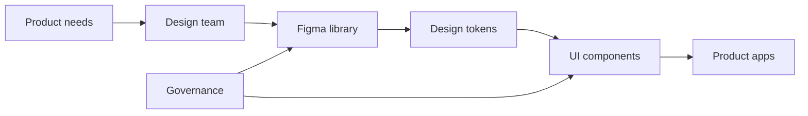

# Design system purpose and governance

**Domain:** Design Systems
**Group:** Foundations and taxonomy
**Role tags:** sr, design-system, design, frontend
**Example environment:** node

## Summary

A design system is the operating layer between product design, UI engineering, and shipped interfaces. Governance defines who can change tokens, components, Figma libraries, package APIs, documentation, and release policy.

## Why it matters

Use this group to clarify what the design system owns, how design and engineering collaborate, and how shared UI language stays coherent across products.

## Architecture sketch



## JavaScript example

```js
const change = { area: 'token', owner: 'design-system', reviewers: ['design', 'frontend'] };
const isGoverned = change.owner === 'design-system' && change.reviewers.includes('design') && change.reviewers.includes('frontend');

console.log({ isGoverned });
```

## Explain it clearly

A solid explanation should define the mechanism, name the failure mode it prevents or creates, and describe the trade-off you would make in a real JavaScript/Node.js application.
