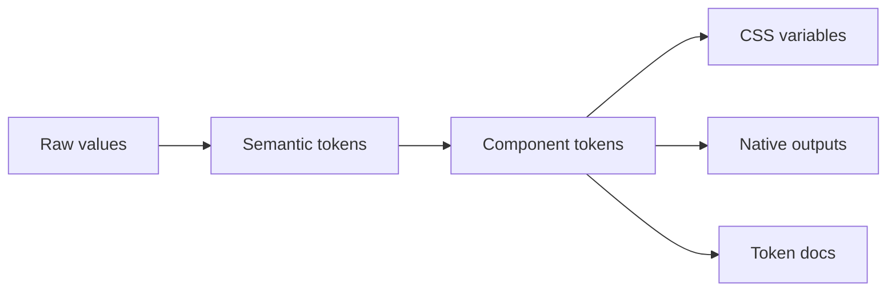

# Design token architecture

**Domain:** Design Systems
**Group:** Tokens and theming
**Role tags:** sr, design-system, design, frontend
**Example environment:** node

## Summary

Design token architecture separates raw values, semantic decisions, component aliases, and platform outputs. This lets a color, spacing, typography, or motion decision move from design source to code without hardcoded drift.

## Why it matters

Use this group to connect Figma variables, semantic tokens, code outputs, themes, and migration paths without letting visual decisions drift between tools.

## Architecture sketch



## JavaScript example

```js
const tokens = {
  raw: { blue500: '#2563eb' },
  semantic: { actionBackground: '{raw.blue500}' },
  component: { buttonPrimaryBackground: '{semantic.actionBackground}' }
};

console.log(tokens.component.buttonPrimaryBackground);
```

## Explain it clearly

A solid explanation should define the mechanism, name the failure mode it prevents or creates, and describe the trade-off you would make in a real JavaScript/Node.js application.
