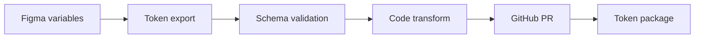

# Figma variables to code tokens

**Domain:** Design Systems
**Group:** Tokens and theming
**Role tags:** sr, design-system, design, frontend, dx
**Example environment:** node

## Summary

Figma variables become reliable code tokens only when naming, modes, aliases, exports, review, and versioning are explicit. The pipeline should detect missing mappings before app code consumes broken values.

## Why it matters

Use this group to connect Figma variables, semantic tokens, code outputs, themes, and migration paths without letting visual decisions drift between tools.

## Architecture sketch



## JavaScript example

```js
const variable = { collection: 'color', mode: 'dark', name: 'surface/default', value: '#111827' };
const tokenName = variable.name.replaceAll('/', '.');

console.log({ [tokenName]: { [variable.mode]: variable.value } });
```

## Explain it clearly

A solid explanation should define the mechanism, name the failure mode it prevents or creates, and describe the trade-off you would make in a real JavaScript/Node.js application.
