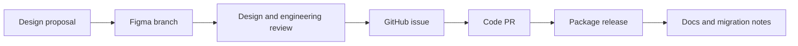

# Governance between Figma and GitHub

**Domain:** Design Systems
**Group:** Adoption and operations
**Role tags:** staff, design-system, design, dx
**Example environment:** node

## Summary

Figma and GitHub governance defines how design decisions become reviewed code changes, packages, docs, and releases. The goal is traceable alignment between the design source of truth and shipped UI components.

## Why it matters

Use this group to treat the design system as a product with roadmap, coverage, governance, package distribution, and debt management.

## Architecture sketch



## JavaScript example

```js
const changeRecord = { figmaBranch: 'button-focus', issue: 128, pullRequest: 412, release: '2.4.0' };
const traceable = Object.values(changeRecord).every(Boolean);

console.log({ traceable });
```

## Explain it clearly

A solid explanation should define the mechanism, name the failure mode it prevents or creates, and describe the trade-off you would make in a real JavaScript/Node.js application.
