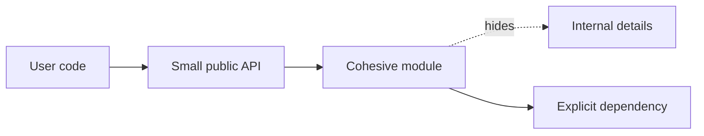

# Cohesion and coupling

**Domain:** Software Engineering
**Group:** Code structure and modularity
**Role tags:** jr, software
**Example environment:** node

## Summary

Cohesion measures how strongly the responsibilities inside a module belong together, while coupling measures how much that module depends on other modules. Good software engineering raises cohesion and controls coupling so changes stay local.

## Why it matters

Use this group to reason about module shape, dependency direction, abstraction, information hiding, and how local code structure affects future change.

## Architecture sketch



## JavaScript example

```js
const userFormatter = {
  displayName(user) {
    return [user.firstName, user.lastName].filter(Boolean).join(' ');
  },
  initials(user) {
    return [user.firstName, user.lastName].filter(Boolean).map((part) => part[0]).join('');
  }
};

console.log(userFormatter.displayName({ firstName: 'Ada', lastName: 'Lovelace' }));
```

## Explain it clearly

A solid explanation should define the mechanism, name the failure mode it prevents or creates, and describe the trade-off you would make in a real JavaScript/Node.js application.
