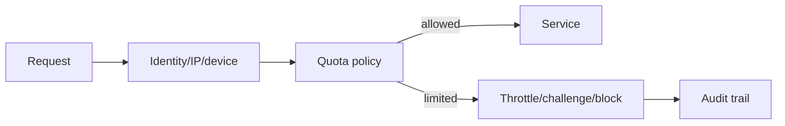

# Abuse and quota controls

**Domain:** System Design
**Group:** Security, abuse, and governance
**Role tags:** sr, system
**Example environment:** node

## Summary

Abuse and quota controls protect systems from spam, scraping, brute force, runaway automation, and unfair resource use. Effective designs combine identity, rate limits, quotas, anomaly detection, and appeal paths.

## Why it matters

Use this group to protect system boundaries, secrets, tenants, quotas, abuse paths, and operational policy surfaces.

## Architecture sketch



## Related concepts

- Backend: Rate limiting algorithms
- Backend: API gateway throttling and caching layers

## JavaScript example

```js
const quotaKey = ({ userId, ip }) => userId ? 'user:' + userId : 'ip:' + ip;

const allow = ({ used, limit }) => used < limit;
console.log({ key: quotaKey({ userId: null, ip: '203.0.113.10' }), allowed: allow({ used: 99, limit: 100 }) });
```

## Explain it clearly

A solid explanation should define the mechanism, name the failure mode it prevents or creates, and describe the trade-off you would make in a real JavaScript/Node.js application.
