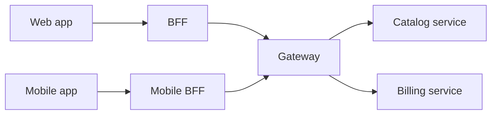

# API gateway and BFF boundaries

**Domain:** System Design
**Group:** Boundaries and topology
**Example environment:** node

## Summary

An API gateway applies cross-cutting concerns such as auth, rate limits, caching, and routing, while a backend-for-frontend shapes APIs around a specific client experience. Mixing them carelessly can create a slow, overloaded coordination layer.

## Why it matters

Use this group to place client, edge, API, service, data, control-plane, and data-plane responsibilities deliberately.

## Architecture sketch



## Related concepts

- Backend: API gateway throttling and caching layers
- Frontend: Micro-frontend orchestration

## JavaScript example

```js
const route = ({ client, path }) => {
  if (client === 'mobile') return 'mobile-bff';
  if (path.startsWith('/internal')) return 'admin-bff';
  return 'web-bff';
};

console.log(route({ client: 'mobile', path: '/orders' }));
```

## Explain it clearly

A solid explanation should define the mechanism, name the failure mode it prevents or creates, and describe the trade-off you would make in a real JavaScript/Node.js application.
