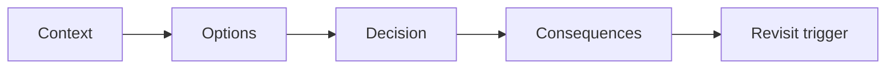

# Architecture decision records

**Domain:** System Design
**Group:** Cost, evolution, and decision records
**Role tags:** sr, system
**Example environment:** node

## Summary

Architecture decision records capture context, decision, alternatives, consequences, and revisit triggers. They preserve the reasoning behind trade-offs so future engineers can change direction without rediscovering old constraints.

## Why it matters

Use this group to keep architecture economically grounded and evolvable through buy/build calls, migrations, and recorded decisions.

## Architecture sketch



## Related concepts

- Backend: Zero-downtime deployment strategies
- Frontend: Frontend architecture and rendering models

## JavaScript example

```js
const adr = {
  status: 'accepted',
  context: 'search latency exceeds SLO',
  decision: 'add read-optimized projection',
  consequences: ['projection lag', 'faster queries'],
  revisitWhen: 'write volume doubles'
};

console.log(adr);
```

## Explain it clearly

A solid explanation should define the mechanism, name the failure mode it prevents or creates, and describe the trade-off you would make in a real JavaScript/Node.js application.
