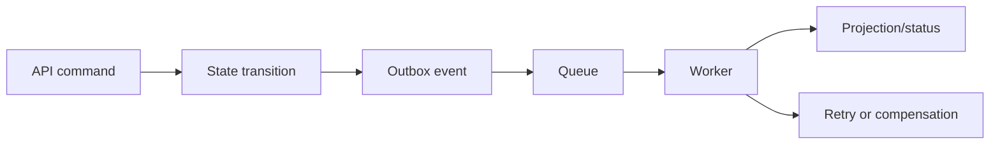

# Async workflow design

**Domain:** System Design
**Group:** Data, consistency, and workflows
**Role tags:** sr, system
**Example environment:** node

## Summary

Async workflow design coordinates durable state changes across queues, jobs, events, retries, and compensations. The design must define ownership, idempotency, retry semantics, visibility, and recovery after partial progress.

## Why it matters

Use this group to connect access patterns, consistency needs, partitions, freshness, events, and workflow recovery into one design.

## Architecture sketch



## Related concepts

- Backend: Outbox pattern for reliable events
- Backend: Background job queues retry semantics

## JavaScript example

```js
const transition = (state, event) => {
  if (state === 'created' && event === 'payment.authorized') return 'paid';
  if (state === 'paid' && event === 'shipment.failed') return 'needs-review';
  return state;
};

console.log(transition('paid', 'shipment.failed'));
```

## Explain it clearly

A solid explanation should define the mechanism, name the failure mode it prevents or creates, and describe the trade-off you would make in a real JavaScript/Node.js application.
