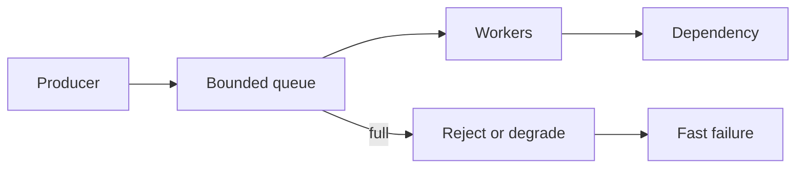

# Backpressure and load shedding

**Domain:** System Design
**Group:** Reliability and operations
**Role tags:** sr, system
**Example environment:** node

## Summary

Backpressure slows producers when downstream systems are saturated, while load shedding rejects or drops work deliberately to preserve critical paths. A design should define queue limits, priorities, retry rules, and user-visible errors.

## Why it matters

Use this group to reason about failure modes, overload behavior, fallback, disaster recovery, observability, alerts, and releases.

## Architecture sketch



## Related concepts

- Frontend: Backpressure in streams API
- Backend: Data pipeline backpressure handling

## JavaScript example

```js
const acceptRequest = ({ queueDepth, maxDepth, priority }) => {
  if (priority === 'critical') return true;
  return queueDepth < maxDepth;
};

console.log(acceptRequest({ queueDepth: 1200, maxDepth: 1000, priority: 'background' }));
```

## Explain it clearly

A solid explanation should define the mechanism, name the failure mode it prevents or creates, and describe the trade-off you would make in a real JavaScript/Node.js application.
