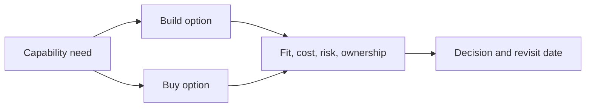

# Build vs buy evaluation

**Domain:** System Design
**Group:** Cost, evolution, and decision records
**Role tags:** sr, system
**Example environment:** node

## Summary

Build vs buy evaluation compares capability fit, integration risk, lock-in, security, operations, support, cost curves, and strategic differentiation. The useful answer is often a staged decision, not a permanent ideology.

## Why it matters

Use this group to keep architecture economically grounded and evolvable through buy/build calls, migrations, and recorded decisions.

## Architecture sketch



## Related concepts

- Backend: Service discovery
- Frontend: Module federation

## JavaScript example

```js
const scoreOption = ({ fit, lockIn, maintenance, strategic }) => {
  return fit + strategic - lockIn - maintenance;
};

console.log({
  build: scoreOption({ fit: 7, lockIn: 1, maintenance: 6, strategic: 5 }),
  buy: scoreOption({ fit: 8, lockIn: 5, maintenance: 2, strategic: 1 })
});
```

## Explain it clearly

A solid explanation should define the mechanism, name the failure mode it prevents or creates, and describe the trade-off you would make in a real JavaScript/Node.js application.
