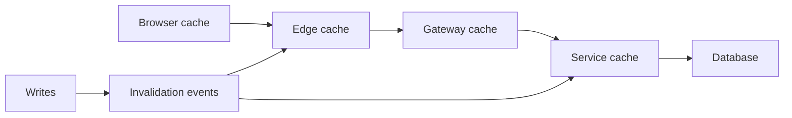

# Cache placement and invalidation

**Domain:** System Design
**Group:** Data, consistency, and workflows
**Role tags:** sr, system
**Example environment:** node

## Summary

Cache placement decides whether data is cached in the browser, edge, gateway, service, database layer, or client state. Invalidation must match freshness requirements, user specificity, mutation flow, and failure behavior.

## Why it matters

Use this group to connect access patterns, consistency needs, partitions, freshness, events, and workflow recovery into one design.

## Architecture sketch



## Related concepts

- Frontend: Cache invalidation strategies
- Backend: Distributed cache invalidation

## JavaScript example

```js
const chooseCache = ({ userSpecific, freshnessSeconds }) => {
  if (userSpecific) return 'service cache with auth-aware key';
  if (freshnessSeconds > 300) return 'edge cache';
  return 'short-lived gateway cache';
};

console.log(chooseCache({ userSpecific: false, freshnessSeconds: 600 }));
```

## Explain it clearly

A solid explanation should define the mechanism, name the failure mode it prevents or creates, and describe the trade-off you would make in a real JavaScript/Node.js application.
