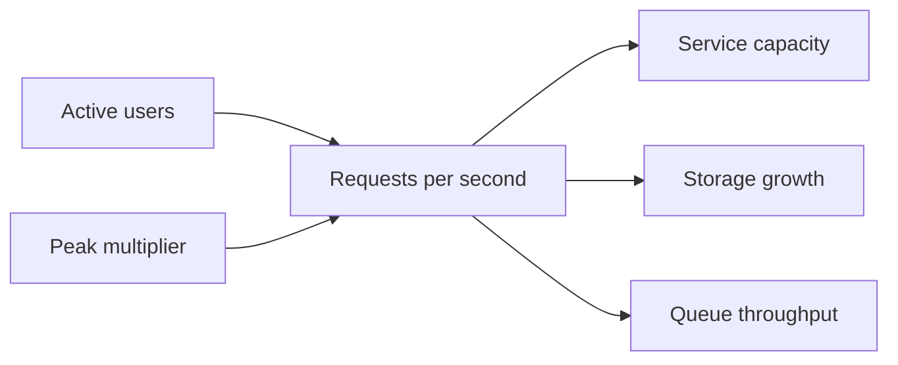

# Capacity estimation

**Domain:** System Design
**Group:** Scale, capacity, and latency
**Role tags:** sr, system
**Example environment:** node

## Summary

Capacity estimation turns traffic, payload size, storage retention, fanout, and peak multipliers into concrete throughput and storage numbers. The goal is not perfect prediction; it is making bottlenecks and scaling assumptions visible.

## Why it matters

Use this group to size traffic, storage, throughput, latency budgets, queues, caches, and concurrency before selecting technology.

## Architecture sketch



## Related concepts

- Backend: Database connection pool exhaustion
- Backend: Data pipeline backpressure handling

## JavaScript example

```js
const estimateCapacity = ({ users, actionsPerUserPerDay, peakMultiplier, bytesPerAction }) => {
  const averageRps = users * actionsPerUserPerDay / 86_400;
  const peakRps = averageRps * peakMultiplier;
  const dailyStorageGb = users * actionsPerUserPerDay * bytesPerAction / 1_000_000_000;
  return { averageRps, peakRps, dailyStorageGb };
};

console.log(estimateCapacity({ users: 500_000, actionsPerUserPerDay: 20, peakMultiplier: 8, bytesPerAction: 1200 }));
```

## Explain it clearly

A solid explanation should define the mechanism, name the failure mode it prevents or creates, and describe the trade-off you would make in a real JavaScript/Node.js application.
