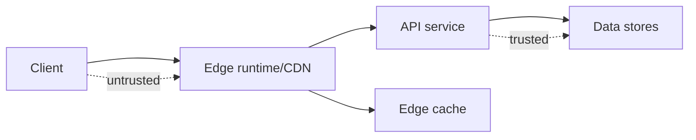

# Client-edge-service boundaries

**Domain:** System Design
**Group:** Boundaries and topology
**Role tags:** sr, system
**Example environment:** node

## Summary

Client, edge, and service boundaries decide where validation, personalization, caching, rendering, authorization, and aggregation live. Good boundaries reduce latency and coupling without leaking trusted responsibilities to untrusted environments.

## Why it matters

Use this group to place client, edge, API, service, data, control-plane, and data-plane responsibilities deliberately.

## Architecture sketch



## Related concepts

- Frontend: Edge rendering
- Backend: API gateway throttling and caching layers

## JavaScript example

```js
const boundaries = [
  { name: 'browser', trusted: false, responsibilities: ['render', 'input validation'] },
  { name: 'edge', trusted: true, responsibilities: ['cache', 'route'] },
  { name: 'api', trusted: true, responsibilities: ['authorize', 'mutate state'] }
];

console.log(boundaries.filter((boundary) => boundary.trusted));
```

## Explain it clearly

A solid explanation should define the mechanism, name the failure mode it prevents or creates, and describe the trade-off you would make in a real JavaScript/Node.js application.
