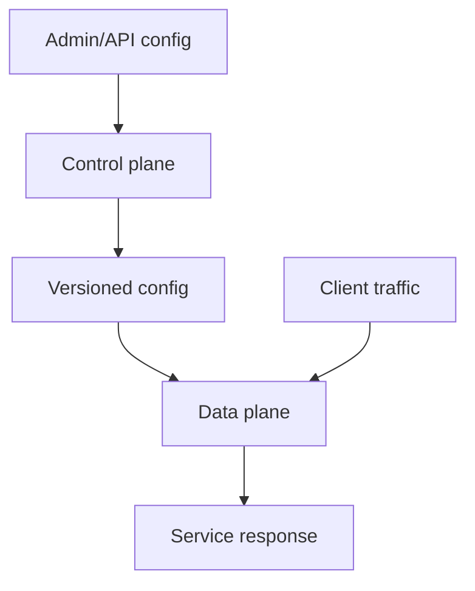

# Control plane vs data plane

**Domain:** System Design
**Group:** Boundaries and topology
**Example environment:** node

## Summary

The control plane configures policy and desired state, while the data plane handles the high-volume request or data path. Separating them keeps runtime traffic fast and resilient even when management workflows are slower or partially unavailable.

## Why it matters

Use this group to place client, edge, API, service, data, control-plane, and data-plane responsibilities deliberately.

## Architecture sketch



## Related concepts

- Backend: Service mesh traffic shifting
- Backend: Feature flags with rollout strategies

## JavaScript example

```js
let activeConfig = { version: 1, canaryPercent: 0 };

export const updateControlPlane = (config) => {
  activeConfig = Object.freeze({ ...config, version: activeConfig.version + 1 });
};

export const routeDataPlaneRequest = (request) => ({ request, configVersion: activeConfig.version });
```

## Explain it clearly

A solid explanation should define the mechanism, name the failure mode it prevents or creates, and describe the trade-off you would make in a real JavaScript/Node.js application.
