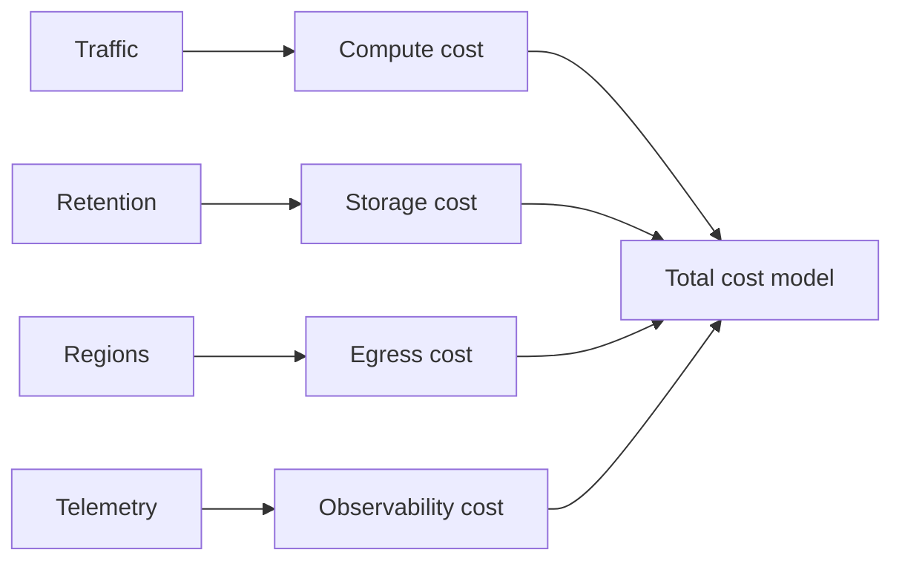

# Cost-aware architecture

**Domain:** System Design
**Group:** Cost, evolution, and decision records
**Role tags:** sr, system
**Example environment:** node

## Summary

Cost-aware architecture models the cost drivers of traffic, storage, compute, egress, third-party APIs, observability, and operational effort. It does not mean choosing the cheapest path; it means making cost part of the design trade-off.

## Why it matters

Use this group to keep architecture economically grounded and evolvable through buy/build calls, migrations, and recorded decisions.

## Architecture sketch



## Related concepts

- Backend: Log aggregation with sampling
- Backend: Serverless cold-start mitigation

## JavaScript example

```js
const monthlyCost = ({ requests, requestCost, storageGb, storageCost }) => {
  return requests * requestCost + storageGb * storageCost;
};

console.log(monthlyCost({ requests: 50_000_000, requestCost: 0.0000002, storageGb: 800, storageCost: 0.08 }));
```

## Explain it clearly

A solid explanation should define the mechanism, name the failure mode it prevents or creates, and describe the trade-off you would make in a real JavaScript/Node.js application.
