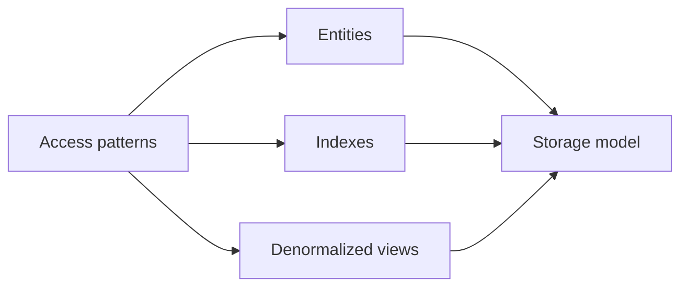

# Data modeling from access patterns

**Domain:** System Design
**Group:** Data, consistency, and workflows
**Role tags:** sr, system
**Example environment:** node

## Summary

Access-pattern-first data modeling starts with queries, writes, cardinality, ordering, and consistency needs before choosing tables, documents, indexes, or streams. It prevents elegant schemas that cannot serve real traffic.

## Why it matters

Use this group to connect access patterns, consistency needs, partitions, freshness, events, and workflow recovery into one design.

## Architecture sketch



## Related concepts

- Backend: Query planner and cost-based optimization
- Backend: B-tree vs LSM-tree index internals

## JavaScript example

```js
const accessPatterns = [
  { name: 'user orders by created time', key: ['userId'], sort: ['createdAt'] },
  { name: 'order by id', key: ['orderId'] }
];

const indexes = accessPatterns.map((pattern) => ({ name: pattern.name, fields: [...pattern.key, ...(pattern.sort ?? [])] }));
console.log(indexes);
```

## Explain it clearly

A solid explanation should define the mechanism, name the failure mode it prevents or creates, and describe the trade-off you would make in a real JavaScript/Node.js application.
