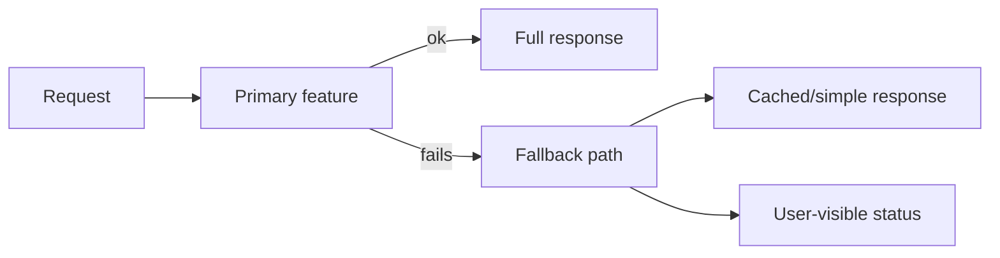

# Degradation and fallback design

**Domain:** System Design
**Group:** Reliability and operations
**Example environment:** node

## Summary

Degradation and fallback design decides which features can be disabled, simplified, cached, or delayed when dependencies fail. Good fallbacks are intentional product states, not accidental error handling.

## Why it matters

Use this group to reason about failure modes, overload behavior, fallback, disaster recovery, observability, alerts, and releases.

## Architecture sketch



## Related concepts

- Backend: Circuit breaker + bulkhead patterns
- Frontend: Optimistic UI rollback strategy

## JavaScript example

```js
const renderRecommendations = async (userId, recommender, popular) => {
  try {
    return await recommender.forUser(userId);
  } catch {
    return popular.items();
  }
};
```

## Explain it clearly

A solid explanation should define the mechanism, name the failure mode it prevents or creates, and describe the trade-off you would make in a real JavaScript/Node.js application.
