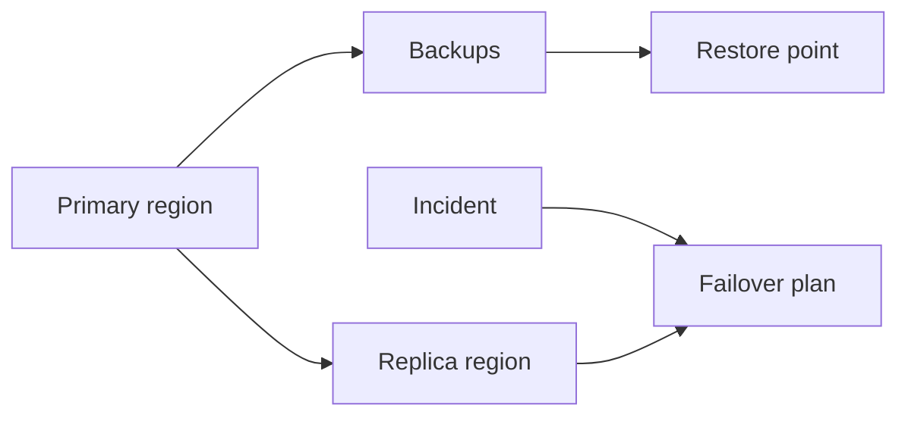

# Disaster recovery objectives (RTO/RPO)

**Domain:** System Design
**Group:** Reliability and operations
**Example environment:** node

## Summary

RTO is how long recovery may take, and RPO is how much data loss is acceptable. These objectives drive backup frequency, replication, failover automation, drills, and whether the design needs active-active or active-passive recovery.

## Why it matters

Use this group to reason about failure modes, overload behavior, fallback, disaster recovery, observability, alerts, and releases.

## Architecture sketch



## Related concepts

- Backend: Database failover and split-brain prevention
- Backend: Read replicas lag monitoring

## JavaScript example

```js
const meetsRecoveryObjectives = ({ backupAgeMinutes, restoreMinutes, rpoMinutes, rtoMinutes }) => {
  return backupAgeMinutes <= rpoMinutes && restoreMinutes <= rtoMinutes;
};

console.log(meetsRecoveryObjectives({ backupAgeMinutes: 4, restoreMinutes: 18, rpoMinutes: 5, rtoMinutes: 30 }));
```

## Explain it clearly

A solid explanation should define the mechanism, name the failure mode it prevents or creates, and describe the trade-off you would make in a real JavaScript/Node.js application.
