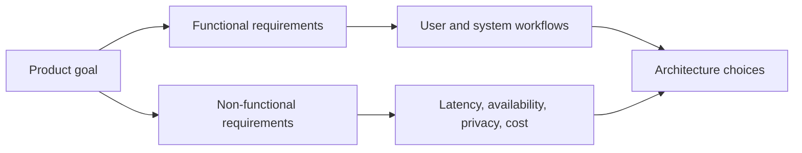

# Functional vs non-functional requirements

**Domain:** System Design
**Group:** Design process and trade-offs
**Role tags:** sr, system
**Example environment:** node

## Summary

Functional requirements describe what the system must do, while non-functional requirements describe qualities such as latency, availability, privacy, durability, scale, and cost. Senior design work makes both explicit before choosing components.

## Why it matters

Use this group to turn product goals into explicit requirements, constraints, trade-offs, and decisions that can be revisited later.

## Architecture sketch



## Related concepts

- Backend: API contract testing
- Frontend: Deterministic rendering

## JavaScript example

```js
const requirements = [
  { id: 'create-order', type: 'functional', must: true },
  { id: 'p95-latency-ms', type: 'quality', target: 250 },
  { id: 'availability', type: 'quality', target: 0.999 }
];

const byType = Map.groupBy(requirements, (item) => item.type);
console.log(Object.fromEntries(byType));
```

## Explain it clearly

A solid explanation should define the mechanism, name the failure mode it prevents or creates, and describe the trade-off you would make in a real JavaScript/Node.js application.
