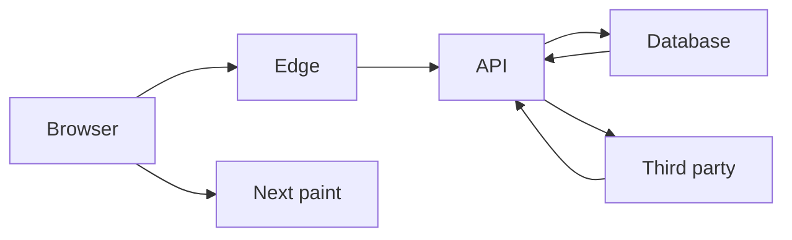

# Latency budget decomposition

**Domain:** System Design
**Group:** Scale, capacity, and latency
**Example environment:** node

## Summary

A latency budget splits an end-to-end target across client work, network hops, edge logic, services, databases, queues, and third-party calls. It helps identify where parallelism, caching, streaming, or simplification is required.

## Why it matters

Use this group to size traffic, storage, throughput, latency budgets, queues, caches, and concurrency before selecting technology.

## Architecture sketch



## Related concepts

- Frontend: Interaction to Next Paint
- Backend: Connection pooling pitfalls

## JavaScript example

```js
const budget = {
  browser: 40,
  network: 60,
  edge: 20,
  api: 80,
  database: 50
};

const total = Object.values(budget).reduce((sum, value) => sum + value, 0);
console.log({ totalMs: total, budget });
```

## Explain it clearly

A solid explanation should define the mechanism, name the failure mode it prevents or creates, and describe the trade-off you would make in a real JavaScript/Node.js application.
