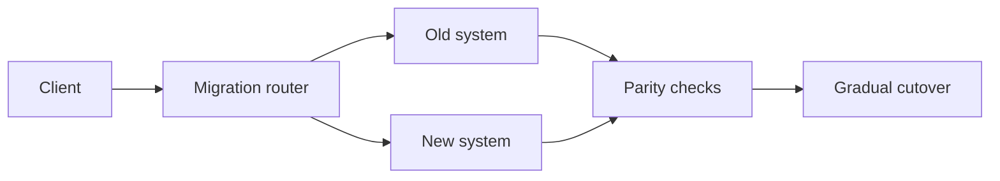

# Migration and strangler patterns

**Domain:** System Design
**Group:** Cost, evolution, and decision records
**Example environment:** node

## Summary

Migration and strangler patterns replace systems incrementally by routing slices of traffic or capability to the new path while the old path keeps running. The design must include parity checks, rollback, data sync, and ownership boundaries.

## Why it matters

Use this group to keep architecture economically grounded and evolvable through buy/build calls, migrations, and recorded decisions.

## Architecture sketch



## Related concepts

- Backend: Blue-green vs canary deployments
- Backend: Backward-compatible schema evolution

## JavaScript example

```js
const routeDuringMigration = ({ tenantId, migratedTenants }) => {
  return migratedTenants.has(tenantId) ? 'new-system' : 'legacy-system';
};

console.log(routeDuringMigration({ tenantId: 'acme', migratedTenants: new Set(['acme']) }));
```

## Explain it clearly

A solid explanation should define the mechanism, name the failure mode it prevents or creates, and describe the trade-off you would make in a real JavaScript/Node.js application.
