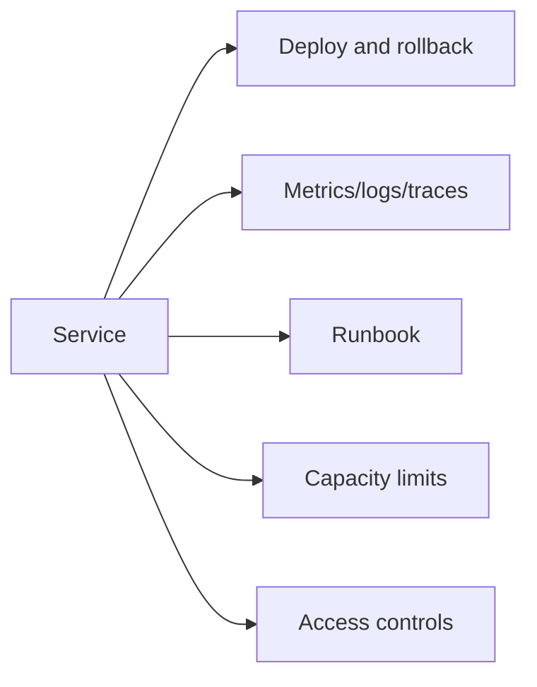

# Operational readiness review

**Domain:** System Design
**Group:** Reliability and operations
**Example environment:** node

## Summary

Operational readiness checks whether a system can be deployed, observed, rolled back, debugged, scaled, secured, and supported before it handles real traffic. It is the practical bridge between design and production ownership.

## Why it matters

Use this group to reason about failure modes, overload behavior, fallback, disaster recovery, observability, alerts, and releases.

## Architecture sketch



## Related concepts

- Backend: Observability tracing propagation
- Backend: Zero-downtime deployment strategies

## JavaScript example

```js
const checklist = {
  dashboards: true,
  alerts: true,
  rollback: true,
  runbook: false
};

const ready = Object.values(checklist).every(Boolean);
console.log({ ready, missing: Object.entries(checklist).filter(([, ok]) => !ok).map(([name]) => name) });
```

## Explain it clearly

A solid explanation should define the mechanism, name the failure mode it prevents or creates, and describe the trade-off you would make in a real JavaScript/Node.js application.
