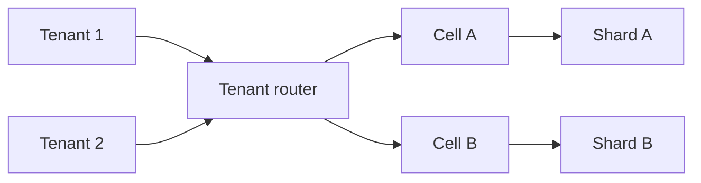

# Partitioning and tenant isolation

**Domain:** System Design
**Group:** Data, consistency, and workflows
**Example environment:** node

## Summary

Partitioning splits data and traffic across shards, tenants, regions, or cells. Tenant isolation adds blast-radius control so one large or unhealthy tenant does not degrade unrelated customers.

## Why it matters

Use this group to connect access patterns, consistency needs, partitions, freshness, events, and workflow recovery into one design.

## Architecture sketch



## Related concepts

- Backend: Sharding strategies
- Backend: Consistent hashing for load balancing

## JavaScript example

```js
const cells = ['cell-a', 'cell-b', 'cell-c'];

const cellForTenant = (tenant) => {
  const hash = [...tenant].reduce((sum, char) => sum + char.charCodeAt(0), 0);
  return cells[hash % cells.length];
};

console.log(cellForTenant('acme'));
```

## Explain it clearly

A solid explanation should define the mechanism, name the failure mode it prevents or creates, and describe the trade-off you would make in a real JavaScript/Node.js application.
