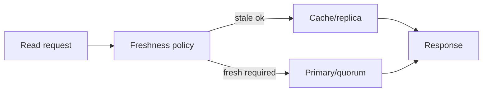

# Read freshness routing

**Domain:** System Design
**Group:** Data, consistency, and workflows
**Role tags:** sr, system
**Example environment:** node

## Summary

Read freshness routing chooses between replicas, caches, primaries, or quorum reads based on how fresh a response must be. It is the system-level version of making read-your-writes and stale-data rules explicit.

## Why it matters

Use this group to connect access patterns, consistency needs, partitions, freshness, events, and workflow recovery into one design.

## Architecture sketch



## Related concepts

- Backend: Read replicas lag monitoring
- Backend: Eventual consistency anti-patterns

## JavaScript example

```js
const routeRead = ({ minVersion, replicaVersion }) => {
  if (replicaVersion >= minVersion) return 'replica';
  return 'primary';
};

console.log(routeRead({ minVersion: 42, replicaVersion: 40 }));
```

## Explain it clearly

A solid explanation should define the mechanism, name the failure mode it prevents or creates, and describe the trade-off you would make in a real JavaScript/Node.js application.
