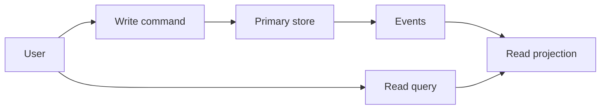

# Read path vs write path design

**Domain:** System Design
**Group:** Boundaries and topology
**Role tags:** sr, system
**Example environment:** node

## Summary

Read paths and write paths often need different guarantees, storage models, caches, and scaling strategies. Separating them clarifies which flows require immediate correctness and which can tolerate projection lag or denormalized views.

## Why it matters

Use this group to place client, edge, API, service, data, control-plane, and data-plane responsibilities deliberately.

## Architecture sketch



## Related concepts

- Backend: CQRS + Event Sourcing projections
- Backend: Read replicas lag monitoring

## JavaScript example

```js
const writeOrder = async (command, store, events) => {
  const order = await store.orders.insert(command);
  await events.publish({ type: 'order.created', orderId: order.id });
  return { accepted: true, orderId: order.id };
};

const readOrderSummary = async (orderId, projection) => projection.get(orderId);
```

## Explain it clearly

A solid explanation should define the mechanism, name the failure mode it prevents or creates, and describe the trade-off you would make in a real JavaScript/Node.js application.
