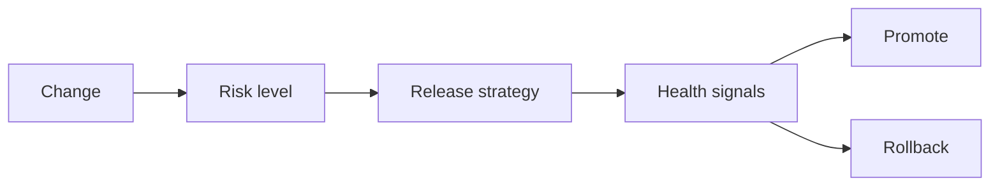

# Release strategy selection

**Domain:** System Design
**Group:** Reliability and operations
**Example environment:** node

## Summary

Release strategy selection chooses between rolling, blue-green, canary, feature flags, shadow traffic, and migrations based on blast radius, reversibility, data compatibility, and confidence signals.

## Why it matters

Use this group to reason about failure modes, overload behavior, fallback, disaster recovery, observability, alerts, and releases.

## Architecture sketch



## Related concepts

- Backend: Blue-green vs canary deployments
- Backend: Feature flags with rollout strategies

## JavaScript example

```js
const chooseRelease = ({ reversible, dataMigration, blastRadius }) => {
  if (dataMigration) return 'expand-contract migration plus feature flag';
  if (reversible && blastRadius === 'low') return 'rolling deploy';
  return 'canary with automated rollback';
};

console.log(chooseRelease({ reversible: true, dataMigration: false, blastRadius: 'high' }));
```

## Explain it clearly

A solid explanation should define the mechanism, name the failure mode it prevents or creates, and describe the trade-off you would make in a real JavaScript/Node.js application.
