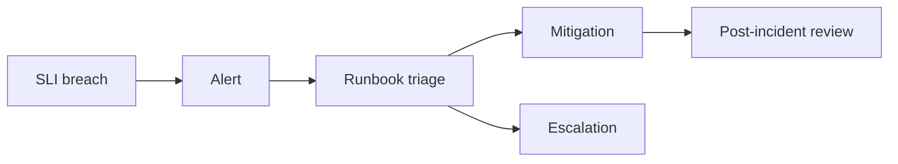

# Runbook and alert design

**Domain:** System Design
**Group:** Reliability and operations
**Example environment:** node

## Summary

Runbook and alert design connects symptoms to ownership, impact, first checks, mitigation, and escalation. Alerts should be tied to user impact or fast-burn risk, not every noisy internal metric.

## Why it matters

Use this group to reason about failure modes, overload behavior, fallback, disaster recovery, observability, alerts, and releases.

## Architecture sketch



## Related concepts

- Backend: Prometheus metric cardinality explosion
- Backend: Chaos engineering principles

## JavaScript example

```js
const shouldPage = ({ errorBudgetBurnRate, windowMinutes }) => {
  return windowMinutes <= 60 && errorBudgetBurnRate >= 14;
};

console.log(shouldPage({ errorBudgetBurnRate: 20, windowMinutes: 30 }));
```

## Explain it clearly

A solid explanation should define the mechanism, name the failure mode it prevents or creates, and describe the trade-off you would make in a real JavaScript/Node.js application.
