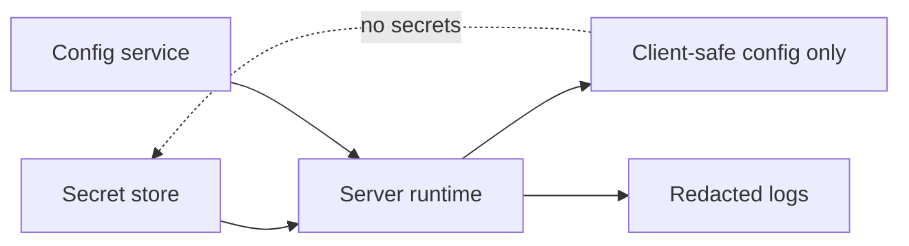

# Secret and configuration boundaries

**Domain:** System Design
**Group:** Security, abuse, and governance
**Role tags:** sr, system
**Example environment:** node

## Summary

Secret and configuration boundaries define where credentials, feature flags, tenant settings, and runtime policy may live. A safe design prevents secrets from leaking to clients, logs, traces, build artifacts, or untrusted plugins.

## Why it matters

Use this group to protect system boundaries, secrets, tenants, quotas, abuse paths, and operational policy surfaces.

## Architecture sketch



## Related concepts

- Backend: Container runtime security
- Frontend: Trusted Types

## JavaScript example

```js
const publicConfig = ({ featureFlags }) => ({ featureFlags });

const serverConfig = {
  featureFlags: { checkoutV2: true },
  paymentSecret: process.env.PAYMENT_SECRET
};

console.log(publicConfig(serverConfig));
```

## Explain it clearly

A solid explanation should define the mechanism, name the failure mode it prevents or creates, and describe the trade-off you would make in a real JavaScript/Node.js application.
