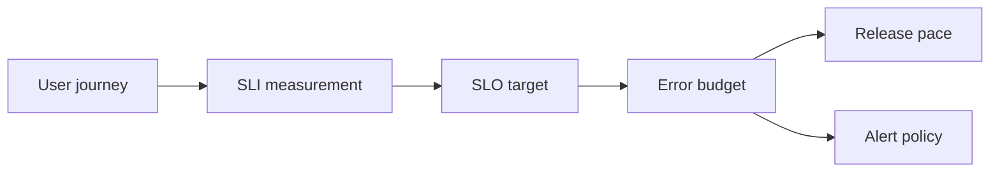

# SLOs and error budgets

**Domain:** System Design
**Group:** Design process and trade-offs
**Role tags:** sr, system
**Example environment:** node

## Summary

SLOs define target reliability for user-visible behavior, while error budgets quantify how much unreliability the system can spend. They turn vague reliability goals into decisions about release pace, alerting, redundancy, and degradation.

## Why it matters

Use this group to turn product goals into explicit requirements, constraints, trade-offs, and decisions that can be revisited later.

## Architecture sketch



## Related concepts

- Backend: Microservices observability
- Backend: Zero-downtime deployment strategies

## JavaScript example

```js
const errorBudget = ({ periodMinutes, slo }) => {
  const allowedFailureMinutes = periodMinutes * (1 - slo);
  return { periodMinutes, slo, allowedFailureMinutes };
};

console.log(errorBudget({ periodMinutes: 30 * 24 * 60, slo: 0.999 }));
```

## Explain it clearly

A solid explanation should define the mechanism, name the failure mode it prevents or creates, and describe the trade-off you would make in a real JavaScript/Node.js application.
