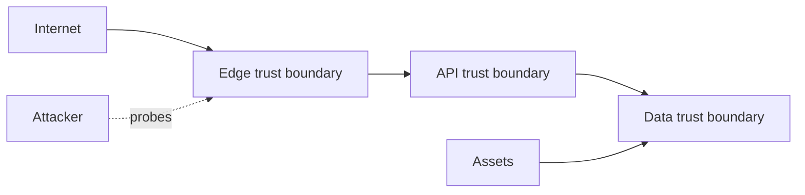

# Threat modeling at system boundaries

**Domain:** System Design
**Group:** Security, abuse, and governance
**Role tags:** sr, system
**Example environment:** node

## Summary

Threat modeling at system boundaries identifies trust zones, entry points, assets, attackers, and mitigations. It keeps security connected to architecture instead of treating it as a checklist after implementation.

## Why it matters

Use this group to protect system boundaries, secrets, tenants, quotas, abuse paths, and operational policy surfaces.

## Architecture sketch



## Related concepts

- Frontend: Content Security Policy
- Backend: OAuth2 token introspection vs JWT validation

## JavaScript example

```js
const trustBoundary = (source, target) => {
  if (source === 'browser' && target === 'api') return 'validate auth, CSRF, schema, and rate limits';
  return 'validate schema and authorization';
};

console.log(trustBoundary('browser', 'api'));
```

## Explain it clearly

A solid explanation should define the mechanism, name the failure mode it prevents or creates, and describe the trade-off you would make in a real JavaScript/Node.js application.
