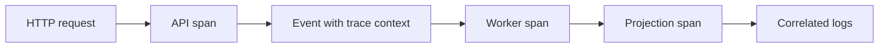

# Tracing across async workflows

**Domain:** System Design
**Group:** Reliability and operations
**Example environment:** node

## Summary

Tracing across async workflows carries correlation through requests, events, jobs, retries, and projections. Without it, the system can appear healthy while individual user workflows disappear between components.

## Why it matters

Use this group to reason about failure modes, overload behavior, fallback, disaster recovery, observability, alerts, and releases.

## Architecture sketch



## Related concepts

- Backend: OpenTelemetry tracing propagation
- Backend: Log aggregation with sampling

## JavaScript example

```js
const enqueue = (event, traceparent) => ({
  ...event,
  metadata: { ...event.metadata, traceparent }
});

console.log(enqueue({ type: 'invoice.created', metadata: {} }, '00-trace-span-01'));
```

## Explain it clearly

A solid explanation should define the mechanism, name the failure mode it prevents or creates, and describe the trade-off you would make in a real JavaScript/Node.js application.
